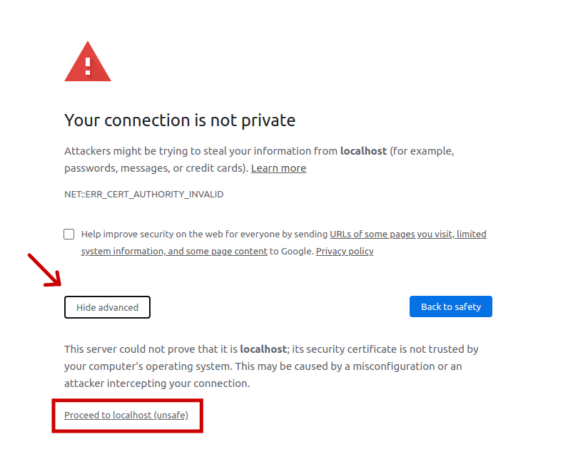

# Quasar Single-SPA
This repo shows how to use [single-spa](https://single-spa.js.org/) with [quasar cli](https://quasar.dev/quasar-cli/installation).

The main problem using single-spa with Quasar is that, in Quasar CLI, 
we don't have access to the `main.js`, which is necessary in all single-spa examples.

## Caveats

- This solution uses the dynamically created file `.quasar/app.js`. 

  So far, it didn't have any breaking changes, but it's a point of attention.

- To use hot reload features, you must run your applications and container in https.

  To do so, when running your application (let's say on port 8080), you **MUST** navigate to 
`https://localhost:8080` and bypass the invalid certificate warning.
  
  It may change slightly from browser to browser, but in general, it's like the following:

  

  You can also use the steps listed here for a more permanent solution:

  https://www.technipages.com/google-chrome-bypass-your-connection-is-not-private-message

